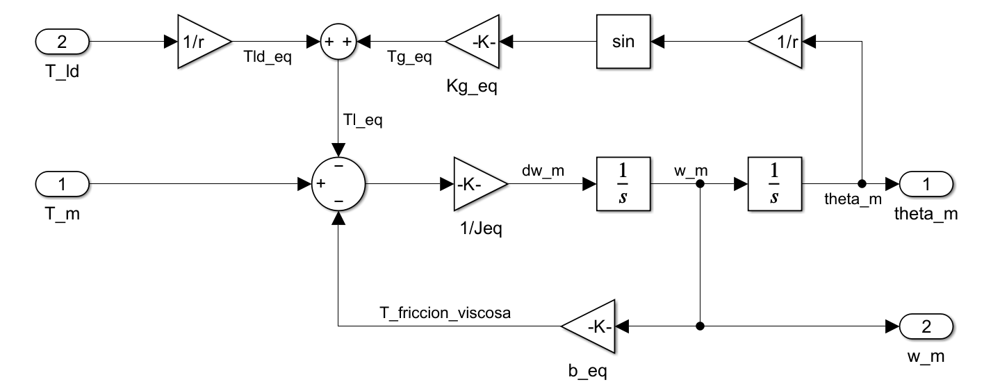
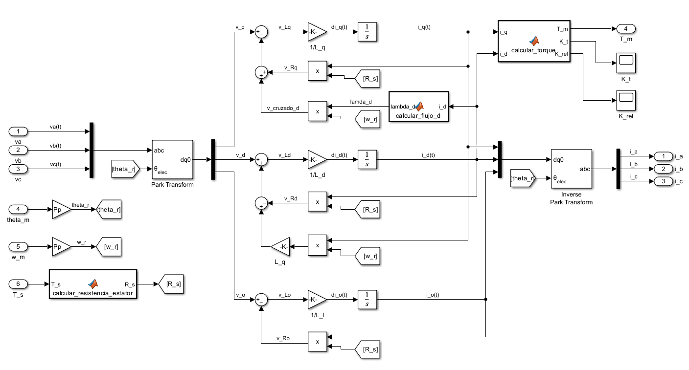
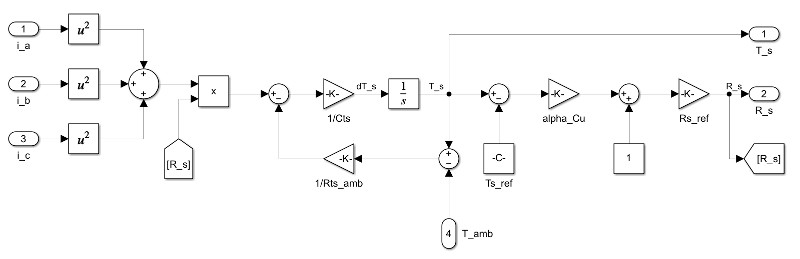
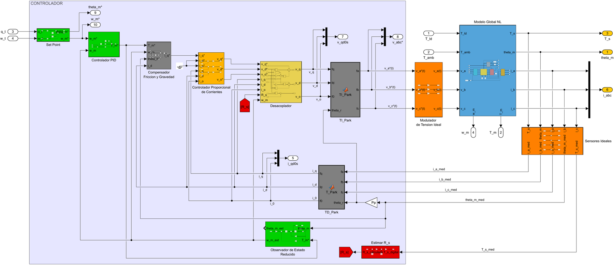
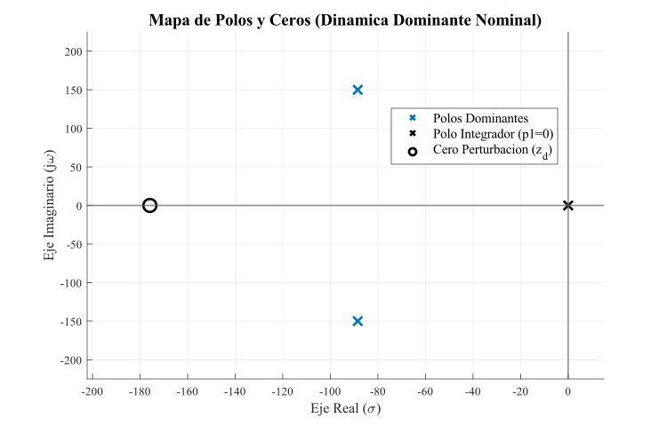
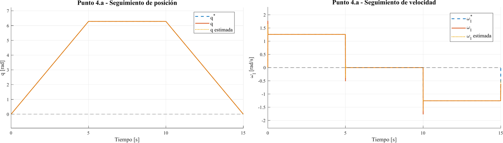
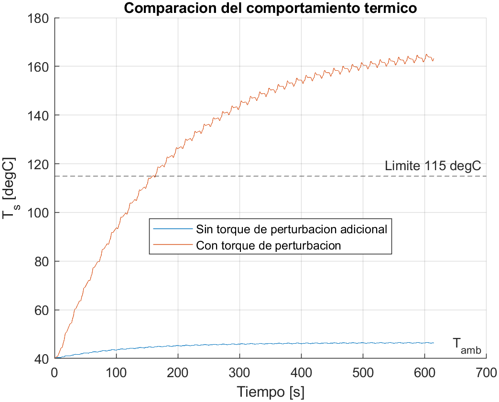

# Control de Accionamiento de CA mediante Motor Síncrono de Imanes Permanentes (PMSM)

**Modelado dinámico, análisis de control y diseño de una arquitectura en cascada (FOC + PID + observador de estado) para el posicionamiento de una carga mecánica de 1 grado de libertad, validado íntegramente por simulación en MATLAB/Simulink.**

[](https://www.mathworks.com/products/matlab.html)
[](https://www.mathworks.com/products/simulink.html)
[](LICENSE)
[](docs/AyME_Informe_2026_Control-de-Accionamiento-de-CA-Mediante-Motor-Sincrono-de-Imanes-Permanentes.pdf)

Proyecto Global Integrador de la asignatura **Automática y Máquinas Eléctricas**, Ingeniería Mecatrónica, Facultad de Ingeniería — Universidad Nacional de Cuyo (Mendoza, Argentina). Año 2026.

---

## Overview (English)

This repository contains the full modeling, analysis, and control design of an AC electric drive built around a three‑phase **Permanent Magnet Synchronous Machine (PMSM)**, a planetary gearbox, and a single‑degree‑of‑freedom mechanical load. The work covers: a coupled mechanical–electromagnetic–thermal nonlinear plant model; Jacobian (LPV) and feedback‑linearization (LTI) analyses of open‑loop stability, observability and controllability; a **cascade control architecture** — an inner field‑oriented current/torque loop with decoupling, an outer PID motion loop, and a reduced‑order state observer for velocity estimation; and a progressive simulation campaign covering reference tracking, disturbance rejection, parametric robustness, non‑ideal sensors/inverter, thermal behavior, and discrete‑time (10 kHz) implementation. Everything is implemented and validated in **MATLAB/Simulink** (no physical hardware was built). The complete 128‑page technical report is in [`docs/`](docs/); this README summarizes it for the repository.

---

## Índice

- [Descripción del proyecto](#descripción-del-proyecto)
- [Objetivos](#objetivos)
- [El sistema físico](#el-sistema-físico)
- [Arquitectura de control](#arquitectura-de-control)
- [Enfoque de modelado y análisis](#enfoque-de-modelado-y-análisis)
- [Campaña de simulación y resultados](#campaña-de-simulación-y-resultados)
- [Conclusiones principales](#conclusiones-principales)
- [Estructura del repositorio](#estructura-del-repositorio)
- [Cómo ejecutar las simulaciones](#cómo-ejecutar-las-simulaciones)
- [Documentación completa](#documentación-completa)
- [Limitaciones y trabajo futuro](#limitaciones-y-trabajo-futuro)
- [Autores](#autores)
- [Licencia](#licencia)

---

## Descripción del proyecto

Este trabajo aborda el modelado, análisis y control de un **accionamiento eléctrico de corriente alterna** basado en un motor sincrónico de imanes permanentes (PMSM), destinado al control de posición de una carga mecánica de un grado de libertad (un eslabón rígido actuado en el plano vertical, sometido a gravedad, fricción y perturbaciones externas).

El desarrollo integra tres etapas:

1. **Modelado físico completo** de los subsistemas mecánico, electromagnético y térmico del accionamiento, obteniendo un modelo dinámico no lineal de sexto orden.
2. **Análisis de control** del sistema linealizado (modelo LPV por Jacobiano y modelo LTI equivalente por linealización por realimentación no lineal), incluyendo estabilidad, observabilidad, controlabilidad y sensibilidad paramétrica.
3. **Diseño e implementación de una arquitectura de control en cascada**, con verificación progresiva de desempeño ante consignas de movimiento, perturbaciones, no idealidades de sensores/inversor, límites térmicos y una implementación discretizada del controlador.

Todo el trabajo se desarrolló y valida mediante **simulación en MATLAB/Simulink** — no se construyó un prototipo físico. El resultado es un informe técnico completo (128 páginas) más el conjunto de modelos y scripts que lo sustentan, ambos incluidos en este repositorio.

## Objetivos

- Desarrollar un modelo dinámico representativo del accionamiento PMSM (mecánico + electromagnético + térmico) referido a un único eje equivalente.
- Analizar las propiedades dinámicas del sistema a lazo abierto: estabilidad, observabilidad, controlabilidad y sensibilidad ante incertidumbre paramétrica (carga, fricción, temperatura).
- Diseñar una estrategia de control en cascada que regule el movimiento de la carga, siga las consignas establecidas y rechace perturbaciones.
- Evaluar el desempeño del sistema en escenarios progresivamente más realistas: parámetros extremos, sensores e inversor no ideales, límites térmicos y control discretizado.
- Identificar las condiciones y limitaciones a considerar en una futura implementación física.

## El sistema físico

El accionamiento modelado está compuesto por:

| Subsistema | Descripción |
|---|---|
| **Carga mecánica** | Eslabón rígido de 1 GDL, modelado como péndulo actuado en el plano vertical (par gravitacional, fricción viscosa, perturbación de torque externa). |
| **Transmisión** | Caja reductora planetaria, relación de transmisión ideal y rígida (`r = 120`). |
| **Motor PMSM** | Máquina sincrónica trifásica de imanes permanentes, modelada en coordenadas `qd0` (transformación de Park) con saliencia magnética (`Ld ≠ Lq`). |
| **Subsistema térmico** | Dinámica de temperatura del bobinado del estator por pérdidas Joule, con resistencia estatórica variable con la temperatura. |
| **Inversor** | Modulador de tensión trifásico; se analiza tanto en su versión idealizada (ganancia unitaria) como con dinámica y saturación no ideales. |
| **Sensores** | Posición (encoder), corrientes de fase y temperatura, evaluados también en su versión no ideal (ancho de banda y retardo limitados). |

Los tres subsistemas centrales (mecánico, electromagnético y térmico) se modelaron primero por separado y se validaron individualmente antes de integrarse en el modelo global no lineal:

<table>
<tr>
<td width="33%"><br/><sub align="center">Subsistema mecánico equivalente</sub></td>
<td width="33%"><br/><sub>Subsistema electromagnético (qd0)</sub></td>
<td width="33%"><br/><sub>Subsistema térmico del estator</sub></td>
</tr>
</table>

## Arquitectura de control

Dada la fuerte no linealidad y los acoplamientos internos de la máquina PMSM, se descartó el control por realimentación completa de estados en favor de una **arquitectura jerárquica en cascada**, con dos escalas de tiempo claramente separadas:

- **Lazo interno (rápido) — Modulador de Torque / Control Vectorial de Corrientes.** Cancela los acoplamientos eléctricos naturales de la máquina (compensación de FCEM y acoplamiento cruzado `d`–`q`) y fuerza a las corrientes a seguir referencias instantáneas bajo la condición de campo orientado (`i_d* = 0`), traduciendo una consigna de torque en tensiones trifásicas de comando.
- **Lazo externo (lento) — Controlador de Movimiento (PID).** Evalúa el error de posición/velocidad de la carga y genera la consigna de torque electromagnético que debe satisfacer el lazo interno, incluyendo compensación de gravedad y fricción.
- **Observador de estado (Luenberger, orden reducido).** Estima la velocidad angular a partir de la medición de posición, evitando el uso de un sensor de velocidad dedicado; se incorpora además una versión extendida con acción integral para eliminar el error estacionario ante perturbaciones sostenidas.

La separación espectral entre lazos (observador más rápido que el controlador de corriente, que a su vez es más rápido que el lazo de movimiento) es la que garantiza la validez del diseño en cascada.

<p align="center">

</p>
<p align="center"><sub>Diagrama de bloques del sistema de control completo implementado en Simulink (set‑point → PID de movimiento → desacoplador/modulador vectorial → planta PMSM no lineal → sensores → observador de estado, realimentando el lazo).</sub></p>

## Enfoque de modelado y análisis

El desarrollo teórico, documentado en detalle en el informe, siguió esta progresión:

1. **Modelo mecánico equivalente**: se refieren la carga y la transmisión al eje del motor, obteniendo inercia (`Jeq`) y fricción (`beq`) equivalentes, y un torque gravitacional no lineal (`sin`) referido al mismo eje.
2. **Modelo electromagnético en coordenadas `qd0`**: transformación de Park directa/inversa, ecuaciones eléctricas del estator, torque electromagnético (componente de imanes + reluctancia) y resistencia estatórica dependiente de la temperatura.
3. **Modelo térmico**: balance de pérdidas Joule y disipación hacia el ambiente, acoplado a la resistencia eléctrica del estator.
4. **Modelo global no lineal (6º orden)**: integración de los tres subsistemas en un único espacio de estados `x = [θm, ωm, i_qs, i_ds, i_0s, Ts]`.
5. **Linealización Jacobiana (modelo LPV)**: familia de modelos lineales locales alrededor de distintos puntos de operación, usada para el análisis de estabilidad, polos/ceros y su migración ante incertidumbre paramétrica.
6. **Linealización por realimentación no lineal (modelo LTI equivalente, 3er orden)**: aplicando la ley de control vectorial (`i_d ≡ 0`) se obtiene una planta electromecánica reducida y desacoplada, base del diseño de los lazos de control.
7. **Análisis de propiedades**: estabilidad a lazo abierto, observabilidad (posición vs. velocidad como salida medida) y controlabilidad completa del modelo LTI equivalente.

<p align="center">

</p>
<p align="center"><sub>Ejemplo de análisis de estabilidad: mapa de polos y ceros del sistema linealizado en condición nominal (uno de los resultados usados para guiar el diseño de los lazos de control y su robustez ante variaciones de carga, fricción y temperatura).</sub></p>

## Campaña de simulación y resultados

El desempeño de la arquitectura de control se evaluó mediante una campaña de simulación incremental en MATLAB/Simulink:

| Escenario | Qué se evaluó |
|---|---|
| **Seguimiento de consignas** | Perfil de posición trapezoidal (1 vuelta en 5 s, permanencia, retorno) vs. perfiles alternativos (trapezoidal de velocidad, polinómico de 5º orden) para respetar los límites físicos de torque/corriente/tensión. |
| **Rechazo de perturbaciones** | Escalón de torque de contacto (`Tld = 5 N·m`) sobre la carga, para condiciones mecánicas nominales y extremas de masa/fricción. |
| **Robustez paramétrica** | Barrido de inercia y fricción de la carga útil (vacío a plena carga) sobre el lazo PID y el observador. |
| **Sensores e inversor no ideales** | Efecto del ancho de banda y retardo de los sensores de posición, corriente y temperatura, y de la dinámica/saturación del inversor, sobre la estabilidad del lazo cerrado. |
| **Comportamiento térmico** | Temperatura del estator en operación cíclica nominal vs. perturbación de torque sostenida, contra el límite térmico admisible (115 °C). |
| **Implementación discreta** | Discretización del controlador y el observador (retenedor de orden cero, integración/derivación numérica) a distintas frecuencias de muestreo (10 kHz, 5 kHz, 2 kHz). |

<p align="center">

</p>
<p align="center"><sub>Seguimiento de posición y velocidad angular (real, estimada por el observador y de referencia) ante la consigna trapezoidal — la posición real y la estimada se superponen prácticamente con la referencia durante toda la simulación.</sub></p>

<p align="center">

</p>
<p align="center"><sub>Temperatura del estator en operación cíclica nominal (≈46,6 °C, estable) vs. torque de perturbación sostenido (supera el límite de 115 °C) — una de las limitaciones físicas concretas identificadas para el accionamiento.</sub></p>

El resto de las figuras generadas durante la campaña (más de 90 en total: seguimiento, errores, torques, corrientes/tensiones, mapas de polos, análisis de robustez, respuesta térmica, comparaciones continuo/discreto, etc.) están disponibles en [`docs/img/`](docs/img/) y desarrolladas en el informe completo.

## Conclusiones principales

- La arquitectura en cascada (modulador vectorial de torque + lazos de corriente + controlador de movimiento) logra un **seguimiento preciso** de consignas físicamente realizables, con compensación de gravedad y fricción reduciendo el acoplamiento visto por el lazo externo.
- Un error de seguimiento reducido **no garantiza por sí solo la viabilidad física**: consignas con cambios bruscos de velocidad generan picos de torque/corriente/tensión que superan los límites del accionamiento; perfiles trapezoidales o polinómicos de 5º orden sí respetan dichos límites.
- El **observador reducido** estima correctamente la velocidad a partir de la posición, aunque presenta error estacionario ante perturbaciones constantes; la versión **extendida con acción integral** lo elimina.
- Los **retardos y anchos de banda limitados de sensores e inversor** pueden degradar el desempeño e incluso provocar inestabilidad si no se sintonizan junto con los lazos de control.
- En operación cíclica nominal la temperatura del estator se estabiliza en ≈46,6 °C (con 40 °C ambiente); ante torque de perturbación sostenido supera los 115 °C admisibles, marcando una **limitación térmica concreta** del accionamiento.
- La implementación **discreta a 10 kHz** reproduce fielmente el comportamiento continuo; a 5 kHz aumenta el rizado y a 2 kHz el sistema no logra completar la simulación satisfactoriamente.

El detalle completo de conclusiones y recomendaciones está en la Sección 5 del [informe técnico](docs/).

## Estructura del repositorio

```text
project-pmsm-ac-drive-control/
├── docs/
│   ├── AyME_Informe_2026_Control-de-Accionamiento-de-CA-...pdf   # informe técnico completo (128 p.)
│   ├── img/                    # figuras y resultados exportados (svg / pdf vectorial / png)
│   │   ├── readme/             # imágenes usadas en este README
│   │   └── resultados/         # resultados de cada escenario de simulación, por punto del informe
│   └── Referencias/            # guías de cátedra y material de referencia
├── sim/
│   ├── config/                 # parámetros físicos y de diseño (params_*.m) + init_sistema_completo.m
│   ├── *.slx                   # modelos Simulink: subsistemas, planta global, controlador, observador,
│   │                           #   modelos LTI/LPV, discretización, sensores e inversor no ideales
│   ├── sim_punto_*.m            # scripts de simulación de cada escenario/entregable del informe
│   ├── analizar_*.m, comparar_*.m, graficar_*.m   # scripts de post-procesamiento y análisis
│   └── controlador_foc_simulink.m, sistema_completo_en_codigo.m  # controlador expresado en código estructurado
├── utils/
│   └── SignalPlotter.m         # utilidad propia para graficar y exportar figuras en PDF vectorial
├── LICENSE
├── .gitignore
└── README.md
```

## Cómo ejecutar las simulaciones

**Requisitos:** MATLAB con Simulink (el proyecto usa bloques `MATLAB Function` para las transformaciones de Park y el cálculo de torque; no requiere toolboxes adicionales más allá de Simulink).

1. Cloná el repositorio y abrí MATLAB con `sim/` como carpeta de trabajo (o agregala al path).
2. Ejecutá el script maestro de inicialización, que carga todos los parámetros físicos, del controlador y del observador necesarios para simular:
   ```matlab
   run('sim/config/iniciar_proyecto.m')
   ```
3. A partir de ahí podés:
   - Abrir directamente el modelo del sistema completo en lazo cerrado, `sim/sistema_completo_con_observador_de_estado.slx`, y simular desde Simulink; o
   - Ejecutar cualquiera de los scripts `sim/sim_punto_*.m`, que reproducen un escenario específico del informe (seguimiento de consignas, rechazo de perturbaciones, observador extendido, etc.), simulan el modelo correspondiente y exportan las figuras de resultados a `docs/img/resultados/`.

Cada script de escenario es autocontenido: agrega al path las carpetas necesarias, corre la inicialización si hace falta y genera sus propias figuras mediante `utils/SignalPlotter.m`.

## Documentación completa

El desarrollo teórico completo — deducciones, ecuaciones, diagramas de bloques y la totalidad de los resultados de simulación — está en el informe técnico:

📄 [`docs/AyME_Informe_2026_Control-de-Accionamiento-de-CA-Mediante-Motor-Sincrono-de-Imanes-Permanentes.pdf`](docs/AyME_Informe_2026_Control-de-Accionamiento-de-CA-Mediante-Motor-Sincrono-de-Imanes-Permanentes.pdf) (128 páginas)

## Limitaciones y trabajo futuro

El informe identifica explícitamente los siguientes puntos como condiciones necesarias para una futura implementación física, y no como conclusiones cerradas:

- Diseñar siempre las consignas de movimiento como **trayectorias físicamente realizables** (velocidad y aceleración limitadas), no solo evaluar el error de seguimiento.
- Verificar las condiciones de operación **máximas simultáneas** (carga útil máxima + perturbación máxima), no solo el caso nominal usado en el ensayo térmico.
- Incorporar disipación térmica mejorada o una estrategia de reducción de prestaciones ante temperaturas cercanas al límite.
- Seleccionar inversor y sensores según su **ancho de banda y retardo real**, no solo su rango o precisión estática, y reajustar los lazos de control si no alcanzan la dinámica supuesta en el diseño.
- Realizar una **validación experimental** (prototipo físico o hardware‑in‑the‑loop) para capturar efectos no representados en simulación: retardos de cálculo, cuantización, resolución del PWM y ruido eléctrico real.

## Autores

Proyecto Global Integrador — Automática y Máquinas Eléctricas, Ingeniería Mecatrónica, UNCuyo (2026).

- Germán Ricco
- Gabriel Mamaní

Profesor titular: Ing. Gabriel L. Julián

## Licencia

Este proyecto se distribuye bajo la licencia [Apache 2.0](LICENSE).
